<!-- ═══════════════════════ HORACE · 观天执天 ═══════════════════════ -->

  

  

  
  
  
   
  
  
  

 

## 🌌 关于我 · About Me

<table>
<tr>
<td width="50%" valign="top">

**中文**

- 🔭 十项全能玄学术数工作站 **Horosa** 的作者 —— 覆盖 **紫微斗数 · 八字 · 占星 · 六壬 · 奇门遁甲 · 太乙 · 六爻 · 风水** 及绝大部分主流推运技法(含正统主限法)。
- 🤖 让 AI「本地挂载一个玄学家」:`horosa-skill` 把术数能力离线赋给你的模型。
- 🖥️ 跨平台交付:**macOS / Windows** 桌面端、**Apple Silicon** 原生、以及手机端适配。
- 🙏 于旧星阁 Horosa 基础上改良制作,感谢 **爽哥**、**郑大哥** 与全体开发团队的贡献。

</td>
<td width="50%" valign="top">

**English**

- 🔭 Author of **Horosa** — an all-in-one Chinese metaphysics workstation for Ziwei, Bazi, Astrology, Liuren, Qimen, Taiyi and more.
- 🤖 `horosa-skill` mounts a *metaphysician* onto your local AI, fully offline-capable.
- 🖥️ Ships cross-platform: macOS / Windows desktop, native Apple Silicon, and mobile.
- 🙏 Built on the legacy Horosa — thanks to **爽哥**, **郑大哥** and the whole dev team.

</td>
</tr>
</table>

## 🛠️ 技术栈 · Tech Stack

  
  
  
  
  
  
  
  

## ⭐ 代表作 · Featured Works

<table width="100%">
<tr>
<td width="490" align="center" valign="top">

#### 🖥️ [Horosa · macOS](https://github.com/Horace-Maxwell/Horosa-Web-App-comprehensively-improved-MacOS)
十项全能玄学术数工作站 · Mac 端 

</td>
<td width="490" align="center" valign="top">

#### 🪟 [Horosa · Windows](https://github.com/Horace-Maxwell/Horosa-Web-App-comprehensively-improved-Windows)
十项全能玄学术数工作站 · Win 端 

</td>
</tr>
<tr>
<td width="490" align="center" valign="top">

#### 🤖 [horosa-skill](https://github.com/Horace-Maxwell/horosa-skill)
让 AI 本地挂载一个玄学家 · 离线术数技能 

</td>
<td width="490" align="center" valign="top">

#### 🍎 [Moira · macOS ARM](https://github.com/Horace-Maxwell/Moira_APP_MacOS_ARM)
Apple Silicon 本地运行的 Moira APP 

</td>
</tr>
<tr>
<td width="490" align="center" valign="top">

#### 📱 [Horosa · PhoneAPP](https://github.com/Horace-Maxwell/Horosa-PhoneAPP-Mac)
星阁手机 APP · Mac 适配 

</td>
<td width="490" align="center" valign="top">

#### 📜 [divination-notes-prompt](https://github.com/Horace-Maxwell/divination-notes-prompt)
荀爽直播 / 星阁文章整理 · AI 命理 prompt 

</td>
</tr>
</table>

## 📈 星图 · GitHub Constellations

  

  
  

  
  

  

  

## 📜 序 · 灵宪

  

<b>📖 总纲 · 灵宪（九条）</b>

 

**第一条**　追寻自由意志与命定论的终极答案。除此之外，别无所求。

**第二条**　着迷于玄学典籍者，皆为同好；胸有块垒不得知者，皆为同仁；求索命运之真相者，皆为同志。

**第三条**　当以正统典籍为纲，博采众论，不拘师说。无派别之见，无隐晦之论。

**第四条**　在技法上，无立场，不背书。只坚持一种方法——严格取得共识的方法。追求干净结论，拒斥一切偏见。

**第五条**　科学是玄学之骨，哲学是玄学之血。制造对立者，必被对立蒙蔽。和解，更加珍贵。

**第六条**　研究工作，和参与者个体严格切分。研究成果，与经济利益严格切分。研究进展与成果，透明、公开，让全体公众知悉。

**第七条**　摆脱西方思维与其文化输入。复原、再兴、发展我们国家的范式与文化。

**第八条**　无神论。神未显，即无神。辩证法是蒙昧的最佳良药。肆意假定乌有之物，是自负，亦是僭越。

**第九条**　遭遇不可避免的外部争端，维护我们的国家。

> 本文将持久扩充、细化、修订，直到和解或共识 
> —— 转载于荀爽文章《灵宪》（http://www.horosa.com/）

<b>📜 道法十八条论纲</b>

 

本站将严格遵守以下论纲：

**一**　“道”的终极追求，乃是「开拓生命的可能性」。 
下摄 3 个目标：存活时间、选择权、能效。 
存活时间，即寿命和克服死亡的能力，长生久视。 
选择权，即怎样度过一生，人有不被限制的选择自由。 
能效，即事半功倍的能力，借技术与方法，助力成功、降低消耗。 
为此，必须采取一切手段，包括节欲、机械、生化……一切都是工具，服务于终极追求。

**二**　“道”的哲学前提，乃是「万物一体」。 
万物一体，即将“感受到的整个世界”，视为生命本身，视为我自己。 
自己的小小肉身，只是生命的部分，并非全部。 
父母、夫妻、师生、宠物、花草、家国、文明，都视若生命。 
我负有敬爱、保护、拓展与教导的责任。

**三**　“道”的雷霆手段，乃是「勇于斗争」。 
为更重要的部分，牺牲不重要的部分。 
为保肉身存活，必杀生以获取能量。慎杀而已。 
为保永远进步，必斗争以清除腐败。慎争而已。 
万物虽一体，但优先级不同：自己 ≥ 身边人 ≥ 陌生人 ≥ 抽象人 ≥ 其他。

**四**　“道”的价值判断，只在于「生命可能性」。 
凡能拓展可能性的，就有价值。能拓展的越多，价值越大。 
价值小者，必须为价值大者让步。 
因此，当代科学（价值）远大于传统玄学（价值）——前者创造可能性，后者禁锢可能性。

**五**　“道”的实践方法，乃是在「兼收并蓄」的基础上「不断革新」。 
对于东方理论，大胆求学，勇于质疑，必须革新。 
对于西方话语，小心求学，严谨论证，警惕心智篡夺。 
北极默然不动，却永远监察一切——即抛除偏见，吸纳一切，以实用为主，以进步为纲，一切服务于生命的无限可能。

**六**　修仙，即修心仙。证道，即证上述大道。

**七**　消灭“道”的一切神秘性。摒弃“道”的一切宗教性。批判“道”的一切保守性。

**八**　神秘，只与「心」有关。除我心外，一切神秘都无法增益我。 
禁绝一切“赎罪券”，禁止宣传一切神秘功能。警惕旧神复辟。 
任何神秘，都不能代替「心的改变」。

**九**　不存在超然的神秘对象。一切神秘，依赖我心。 
「神」是我心，「仙」是我心；「魔」是我心，「鬼」是我心。 
我即元始，元始即我。神魔本一体，我心即神魔。

**十**　不存在起点，不存在终点。创世、终末与轮回，皆为幻想。 
我即起点，我即终点，我即轮回。

**十一**　不存在因果，只有「逻辑上的可能」。 
做善事，不一定有好报，但必定“与道合真”。 
道之所在，虽千万人敌对，吾往矣。善恶与回报，互不相干。

**十二**　没有人能用神秘的名义，宣判罪恶、裁度孽障、打击异端；如此做事，只为争名夺利、魅惑苍生。 
宗教没有“赦罪”的资格，它只能赦免「靠自己的恐吓加于人们的惩罚」。 
用「来世之好」「地狱之苦」恐吓世人者，皆是大道之敌。

**十三**　酆都与天庭，只在心的一念间。炼度，就只是「修心」。 
借由自恨与自省，将黯淡自私的小我，炼度为万物一体的光明。 
酆都与天庭的区别，只是「绝望」与「真诚」的信念不同——信念不同，境界当即不同。一点灵心即可超拔飞升。

**十四**　炼度，只可用于活人，不能炼度死人；无所谓炼度“冤亲债主”。 
亡魂只存在于「亲人的心」，炼魂实则是炼在世亲人之心。 
大肆鼓吹“冤亲债主”，必然使大多数人受骗上当。

**十五**　当金币在科仪箓文中叮当作响，增加的只是贪婪和利己之心。至于功效，仅由你自己的心主宰。

**十六**　必须训示所有道友： 
神秘仪式 ≠ 功德，神秘仪式 ≠ 变好；公益事业，比神秘仪式的效果好一百倍。 
神秘仪式不能清洗人心，亦不能修仙证道；万物一体的大爱，才能激发善举，使生活更好。 
不珍惜生命、不助穷苦、不推动文明，却花钱在神秘仪式上，得到的不是功德，而是制裁——浪费血汗，挥霍开拓可能性的筹码。 
生活不富裕，就应当把钱留给家庭，不要浪费给神秘仪式。 
神秘仪式，只有心灵不依赖它时才有效（作用于心）；若因此收高价，它将最为邪恶，必腐败人心。

**十七**　倘若有真正的「行道者」： 
他一定焚毁所有殿宇，也不愿用穷人的血汗来建造它； 
他一定拿自己的钱，甚至不惜卖掉所有地产，来赈济人民； 
他一定不遗余力，推动科学技术进步，拓展生命的疆域； 
他一定效法张道陵，禁绝淫祀，斩灭乱神； 
他一定效法许旌阳，替天斩龙，济国利民； 
他一定效法寇谦之，清肃魔教，断除伪法； 
他一定效法萨守坚，一点心光，驾驭真雷。

**十八**　只清虚，不务实，非道；只分裂，不团结，非道；只解构，不建设，非道； 
只效今，不知古，非道；只崇西，不尊东，非道；只对立，不统一，非道； 
只混淆，不斗争，非道；只内斗，不外争，非道；只独断，不兼容，非道；只抽象，不现实，非道。

> —— 转载自星阙 Horosa《道法十八条论纲》

## 🔮 联系 · Connect

  
  

  

