<!-- ═══════════════════════ HORACE · 观天执天 ═══════════════════════ -->

<div align="center">
  
</div>

<div align="center">
  <a href="https://github.com/Horace-Maxwell">
    
  </a>
</div>

<div align="center">
  
  
  
</div>

<br/>

## 🌌 关于我 · About Me

<table>
<tr>
<td width="60%" valign="top">

**中文**

- 🔭 十项全能玄学术数工作站 **Horosa** 的作者 —— 覆盖 **紫微斗数 · 八字 · 占星 · 六壬 · 奇门遁甲 · 太乙 · 六爻 · 风水** 及绝大部分主流推运技法（含正统主限法）。
- 🤖 让 AI「本地挂载一个玄学家」：`horosa-skill` 把术数能力离线赋给你的模型。
- 🖥️ 跨平台交付：**macOS / Windows** 桌面端、**Apple Silicon** 原生、以及手机端适配。
- 🙏 于旧星阁 Horosa 基础上改良制作，感谢 **爽哥**、**郑大哥** 与全体开发团队的贡献。

**English**

- 🔭 Author of **Horosa** — an all-in-one Chinese metaphysics workstation for Ziwei, Bazi, Astrology, Liuren, Qimen, Taiyi and more.
- 🤖 `horosa-skill` mounts a *metaphysician* onto your local AI, fully offline-capable.
- 🖥️ Ships cross-platform: macOS / Windows desktop, native Apple Silicon, and mobile.

</td>
<td width="40%" valign="top">

```yaml
name:     Horace
pronouns: he / him
motto:    观天之道 · 执天之行
craft:
  - 紫微斗数  / Ziwei
  - 八字      / Bazi
  - 占星      / Astrology
  - 六壬·奇门·太乙
stack:  [JS, Python, Java, Dart, AI]
focus:  玄学 × AI × 跨端
```

</td>
</tr>
</table>

## 🧭 术数 · The Arts

<div align="center">
  
  
  
  
  
  
  
  
</div>

## 🛠️ 技术栈 · Tech Stack

<div align="center">
  
  
  
  
  
  
  
  
</div>

## ⭐ 代表作 · Featured Works

<div align="center">
  <a href="https://github.com/Horace-Maxwell/Horosa-Web-App-comprehensively-improved-MacOS">
    
  </a>
  <a href="https://github.com/Horace-Maxwell/Horosa-Web-App-comprehensively-improved-Windows">
    
  </a>
</div>
<div align="center">
  <a href="https://github.com/Horace-Maxwell/horosa-skill">
    
  </a>
  <a href="https://github.com/Horace-Maxwell/Moira_APP_MacOS_ARM">
    
  </a>
</div>
<div align="center">
  <a href="https://github.com/Horace-Maxwell/Horosa-PhoneAPP-Mac">
    
  </a>
  <a href="https://github.com/Horace-Maxwell/divination-notes-prompt">
    
  </a>
</div>

## 📈 星图 · GitHub Constellations

<div align="center">
  
  
</div>

<div align="center">
  
</div>

<div align="center">
  
</div>

<div align="center">
  
</div>

## 🔮 联系 · Connect

<div align="center">
  <a href="https://sites.google.com/view/horace-horosa/%E4%B8%BB%E9%A1%B5">
    
  </a>
  <a href="mailto:maxwelldhx@gmail.com">
    
  </a>
</div>

<br/>

<div align="center">
  
  <sub>「 观天之道,执天之行。 」 · <i>Observe the Way of Heaven, and hold to its workings.</i></sub>
</div>
