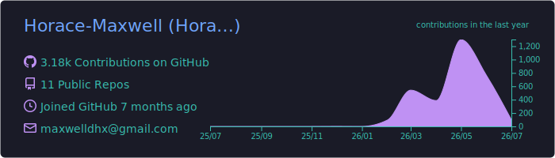
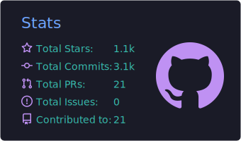
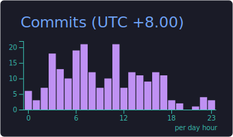
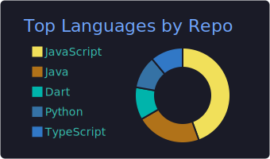
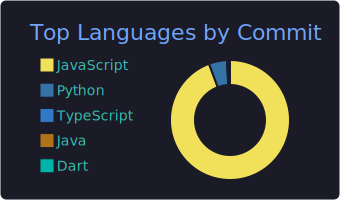

<!-- ═══════════════════════ HORACE · 观天执天 ═══════════════════════ -->

  

  

  
  
  
   
  
  
  

 

## 🌌 关于我 · About Me

<table>
<tr>
<td width="50%" valign="top">

**中文**

- 🔭 十项全能玄学术数工作站 **Horosa** 的作者 —— 覆盖 **紫微斗数 · 八字 · 占星 · 六壬 · 奇门遁甲 · 太乙 · 六爻 · 风水** 及绝大部分主流推运技法(含正统主限法)。
- 🤖 让 AI「本地挂载一个玄学家」:`horosa-skill` 把术数能力离线赋给你的模型。
- 🖥️ 跨平台交付:**macOS / Windows** 桌面端、**Apple Silicon** 原生、以及手机端适配。
- 🙏 于旧星阁 Horosa 基础上改良制作,感谢 **爽哥**、**郑大哥** 与全体开发团队的贡献。

</td>
<td width="50%" valign="top">

**English**

- 🔭 Author of **Horosa** — an all-in-one Chinese metaphysics workstation for Ziwei, Bazi, Astrology, Liuren, Qimen, Taiyi and more.
- 🤖 `horosa-skill` mounts a *metaphysician* onto your local AI, fully offline-capable.
- 🖥️ Ships cross-platform: macOS / Windows desktop, native Apple Silicon, and mobile.
- 🙏 Built on the legacy Horosa — thanks to **爽哥**, **郑大哥** and the whole dev team.

</td>
</tr>
</table>

## 🛠️ 技术栈 · Tech Stack

  
  
  
  
  
  
  
  

## ⭐ 代表作 · Featured Works

<table width="100%">
<tr>
<td width="490" align="center" valign="top">

#### 🖥️ [Horosa · macOS](https://github.com/Horace-Maxwell/Horosa-Web-App-comprehensively-improved-MacOS)
十项全能玄学术数工作站 · Mac 端 

</td>
<td width="490" align="center" valign="top">

#### 🪟 [Horosa · Windows](https://github.com/Horace-Maxwell/Horosa-Web-App-comprehensively-improved-Windows)
十项全能玄学术数工作站 · Win 端 

</td>
</tr>
<tr>
<td width="490" align="center" valign="top">

#### 🤖 [horosa-skill](https://github.com/Horace-Maxwell/horosa-skill)
让 AI 本地挂载一个玄学家 · 离线术数技能 

</td>
<td width="490" align="center" valign="top">

#### 🍎 [Moira · macOS ARM](https://github.com/Horace-Maxwell/Moira_APP_MacOS_ARM)
Apple Silicon 本地运行的 Moira APP 

</td>
</tr>
<tr>
<td width="490" align="center" valign="top">

#### 📱 [Horosa · PhoneAPP](https://github.com/Horace-Maxwell/Horosa-PhoneAPP-Mac)
星阁手机 APP · Mac 适配 

</td>
<td width="490" align="center" valign="top">

#### 📜 [divination-notes-prompt](https://github.com/Horace-Maxwell/divination-notes-prompt)
荀爽直播 / 星阁文章整理 · AI 命理 prompt 

</td>
</tr>
</table>

## 📈 星图 · GitHub Constellations

  

  
  

  
  

  

  

## 🔮 联系 · Connect

  
  

  
  「 观天之道,执天之行。 」 · <i>Observe the Way of Heaven, and hold to its workings.</i>

